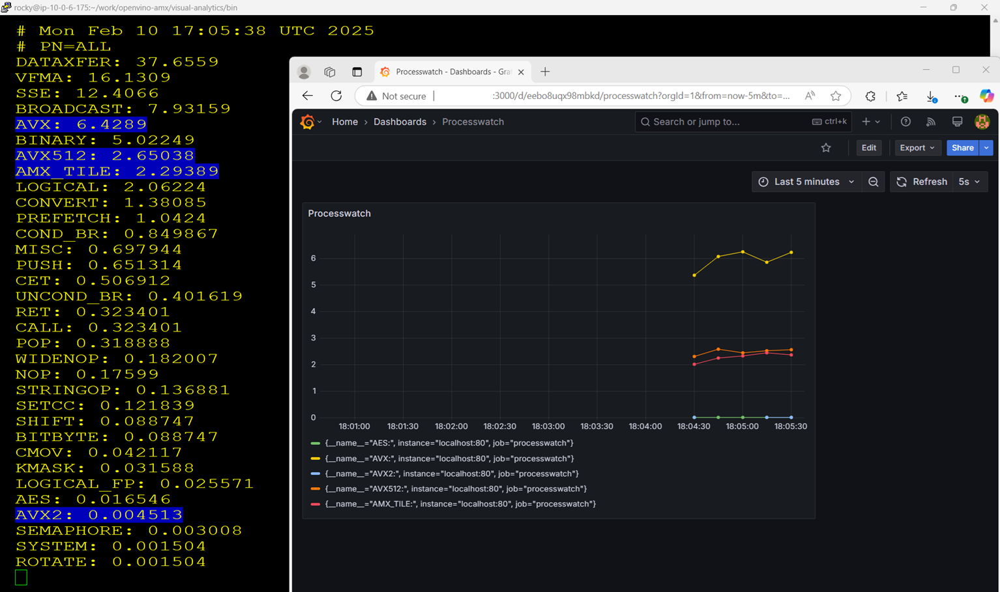

# processwatch

Docker version of https://github.com/intel/optimized-cloud-recipes/blob/main/AMX_VALIDATION.md with added Prometheus scrapping and Grafana dashboard.

## (Optional) Prepare

Build with

```
cd build
./build.sh
```

Set environment variable IMAGEREPOUSER to your Docker Hub username, and publish to Docker Hub with

```
export IMAGEREPOUSER=yourdockerhubusername
./push.sh
```

or do similar for another container image repository.

In [start.sh](./start.sh) update image name to point to where you pushed it.

## Run

To get CPU instructions usage, run it with optional argument for a process name (that can run in multiple processes):

```
./start.sh [processname]
```

Get Prometheus scrapping and graph with:

```
./prometheus.sh
```

With modern browser like Edge observe usage of AVX512 on URL like http://hostFQDNorIP:9090/query?g0.expr=AVX512%3A&g0.show_tree=0&g0.tab=graph&g0.range_input=5m&g0.res_type=auto&g0.res_density=medium&g0.display_mode=lines&g0.show_exemplars=0

Start Grafana with:

```
./grafana.sh
```

With the browser open URL http://hostFQDNorIP:3000 and login as "admin" with "password". In dashboards http://hostFQDNorIP:3000/dashboards select "Processwatch", press key "v" to View it, reduce time range to "Last 15 minute" and set Refresh to "5s".

Now start some application workloads that are enabled to use AMX, AVX512 or other CPU instructions, and observe how usage of those goes up.

Here is an example view of the screens:



## Stop

Stop all containers with:

```
./stop.sh
```

which if started with scripts above will also remove those containers.
